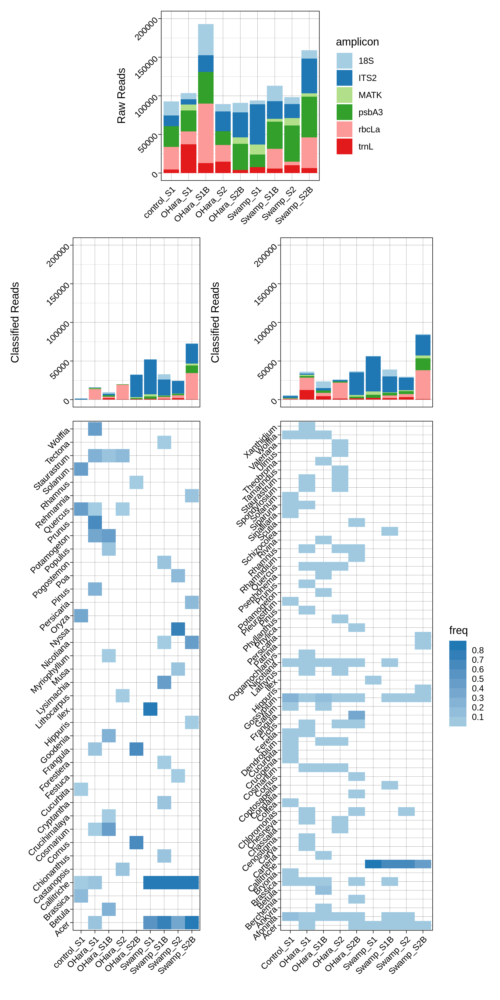

```{r setup, include=FALSE}
knitr::opts_chunk$set(echo = FALSE)
```

# Abstract

*Premise of the study* – Cellular and cell-free DNA obtained from environmental samples of soil, water, and air can detect local biodiversity. Environmental DNA (eDNA) sequencing typically relies on standard molecular techniques and resources. Here we present a fully portable workflow designed to work with limited infrastructure for the collection, isolation, extraction, sequencing, and analysis of aquatic eDNA for the monitoring of plant biodiversity.

*Methods* – We extracted aquatic eDNA from an open pond and a seasonal wetland. Samples were amplified targeting 350bp to 890bp segments from psbA3, rbcLa, ITS2, 18S, trnL genomic regions. Amplified DNA was barcoded, pooled up to twelve reactions per run, and sequenced on the Oxford Nanopore MinION sequencer using the low-throughput Flongle flowcells.  Amplicon sequences were classified using Kraken2 and BLAST followed by a lowest common ancestor algorithm using the NCBI taxonomy.

*Results* – Sequence analysis reveals highly local differences in plant diversity including both aquatic and terrestrial plant taxa. 

*Discussion* – The workflow built around this platform provides end-to-end amplicon-based sequencing that can be used to detect nearby plant diversity. The Oxford Nanopore MinION sequencer and the low throughput Flongle flowcell provides a sequencing platform that combines portability, low cost, and ease of use that are essential features for field applications of amplicon metabarcoding.


even citations like this one [@R-rmarkdown]. The rest of this example poster will show how you can insert typical conference poster features into your own document. 

## Objectives


# Methods


# Results

You can reference tables like so: Table \@ref(tab:mytable). 

```{r mytable, out.width='80%'}
knitr::kable(iris[1:10, 1:4], caption = 'Table caption.',align = 'c',"html")
```

Or with figures: Figure \@ref(fig:classifig), or Figure \@ref(fig:ordifig).

```{r classifig, out.width='100%', fig.align='center', fig.cap='eDNA Classification Results', fig.height=12}
#
suppressMessages(require(imager))
image_filename='../figures/figure2_all.png'
image <- load.image(image_filename)
plot(image, axes=F)
```

```{r ordifig, out.width='100%', echo=FALSE, fig.cap='BLAST ordination plot', fig.height=5}
suppressMessages(require(imager))
ordiplot1='../figures/ordiplot.png'
ordiplot2='../figures/kraken_ordiplot.png'

image1 <- load.image(ordiplot1)
image2 <- load.image(ordiplot2)

plot(image1, axes=F)

```

# Next Steps


# Conclusion

```{r, include=FALSE}
knitr::write_bib(c('knitr','rmarkdown','posterdown','pagedown'), 'packages.bib')
```

# References
